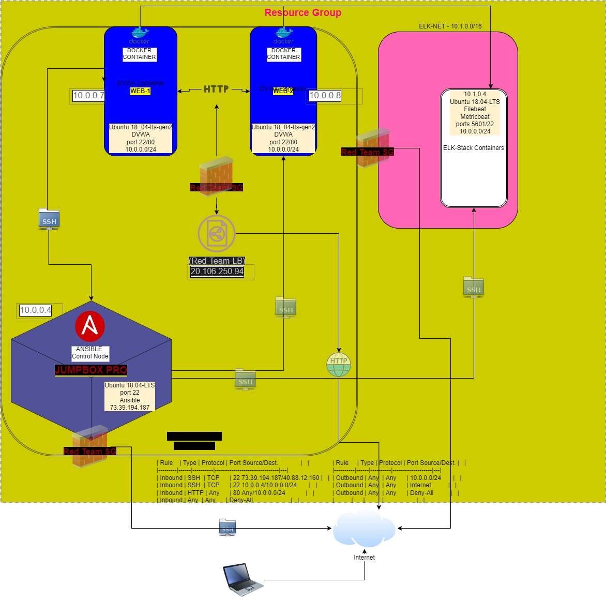

# GW_Cyber
GW Bootcamp Repository

## Automated ELK Stack Deployment

The files in this repository were used to configure the network depicted below.

These files have been tested and used to generate a live ELK deployment on Azure. They can be used to either recreate the entire deployment pictured above. Alternatively, select portions of the install-elk.txt file may be used to install only certain pieces of it, such as Filebeat.

This document contains the following details:
- Description of the Topology
- Access Policies
- ELK Configuration
  - Beats in Use
  - Machines Being Monitored
- How to Use the Ansible Build

### Description of the Topology

The main purpose of this network is to expose a load-balanced and monitored instance of DVWA, the D*mn Vulnerable Web Application.

Load balancing ensures that the application will be highly available, in addition to restricting access (only by ssh) to the network.

Integrating an ELK server allows users to easily monitor the vulnerable VMs for changes to the file system and system metrics such as uptime.
- What does Filebeat watch for? The what and when of file system changes on the DVWA VMs.
- What does Metricbeat record? The DVWA metrics such as uptime.

The configuration details of each machine may be found below.

| Name       | Function       | IP Address   | Operation System |   |
|------------|----------------|--------------|------------------|---|
| Jump Box   | Gateway        | 40.88.12.160 | Linux            |   |
| ELK-SERVER | Data Analytics | 10.1.0.4     | Linux            |   |
| Web-1      | DVWA-Server    | 10.0.0.13    | Linux            |   |
| Web-2      | DVWA-Server    | 10.0.0.14    | Linux            |   |

### Access Policies

The machines on the internal network are not exposed to the public Internet. 

Only the 73.39.194.187 (my ip) machine can accept connections from the Internet. Access to this machine is only allowed from the following IP addresses:
73.39.194.187

Machines within the network can only be accessed by Jump box - ip 40.88.12.160.

A summary of the access policies in place can be found in the table below.

| Name     | Publicly Accessible | Allowed IP Addresses |
|----------|---------------------|----------------------|
| Jump Box | Yes                 | 73.39.194.187        |
|ELK-SERVER| No                  |                      |
|Web-1     | No                  |                      |
|Web-2     | No                  |                    

### Elk Configuration

Ansible was used to automate configuration of the ELK machine. No configuration was performed manually, which is advantageous because it reduces (practically eliminates) the potential for human error and streamlines duplication.

It practically eliminates the potential for human error or greatly reduces it while allowing for scaling with the click of a mouse.

The playbook implements the following tasks:

- 1. install docker.io
- 2. install pip3
- 3. install docker python module
- 4. increase memory cap
- 5. download and launch a docker elk container
- ...

The following screenshot displays the result of running `docker ps` after successfully configuring the ELK instance.

### Target Machines & Beats
This ELK server is configured to monitor the following machines:

Web-1 10.0.0.13
Web-2 10.0.0.14

We have installed the following Beats on these machines:
- _TODO: Specify which Beats you successfully installed_
Filebeat and Metricbeat

These Beats allow us to collect the following information from each machine:
- _TODO: In 1-2 sentences, explain what kind of data each beat collects, and provide 1 example of what you expect to see. E.g., `Winlogbeat` collects Windows logs, which we use to track user logon events, etc._
Filebeat collects file system logs, I expect to see various changes of Web-1 and Web-2 files and file activities.
Metricbeat collects process system logs and I expect to see data concerning system process uptime and various system specific metrics.

### Using the Playbook
In order to use the playbook, you will need to have an Ansible control node already configured. Assuming you have such a control node provisioned: 

SSH into the control node and follow the steps below:
- Copy the __yml___ file to _ansible____.
- Update the __hosts___ file to include the IP of the VMs
- Run the playbook, and navigate to _http://168.61.161.7:5601/___ to check that the installation worked as expected.

_TODO: Answer the following questions to fill in the blanks:_
- _Which file is the playbook? Where do you copy it?_ 
- _Which file do you update to make Ansible run the playbook on a specific machine? How do I specify which machine to install the ELK server on versus which to install Filebeat on?_
- _Which URL do you navigate to in order to check that the ELK server is running?

_As a **Bonus**, provide the specific commands the user will need to run to download the playbook, update the files, etc._
